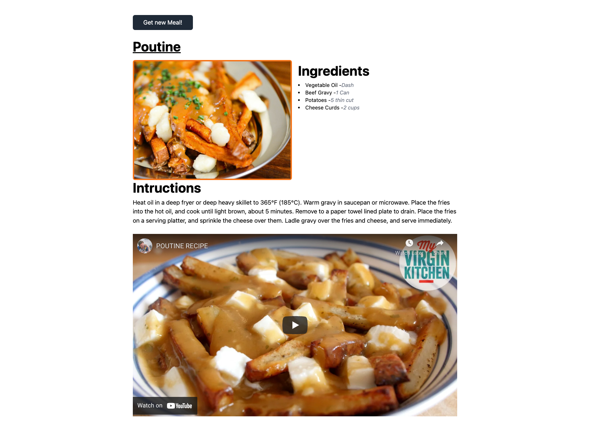

This project was bootstrapped with [Create React App](https://github.com/facebook/create-react-app).

## Available Scripts

In the project directory, you can run:

### `yarn install`

Instal All dependencies in this project

### `yarn dev`

Runs the app in the development mode. 
Open [http://localhost:3000](http://localhost:3000) to view it in the browser.

### Link

Vite: https://vitejs.dev/guide/#scaffolding-your-first-vite-project
Tailwind CSS: https://tailwindcss.com/docs/guides/vite
TheMealDb: https://www.themealdb.com/api.php
Embed youtube: https://www.themes.dev/blog/easily-embed-responsive-youtube-video-with-tailwind-css/

### Video Tutorial

You can see my youtube video for this project in [here](https://youtu.be/1Q7diFXRpOA)